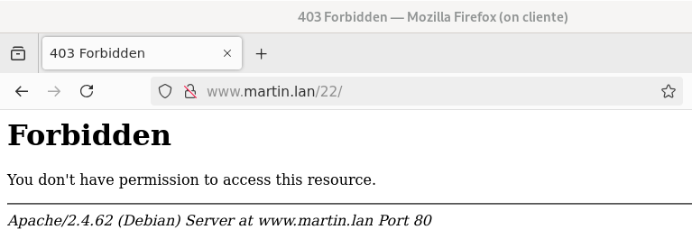
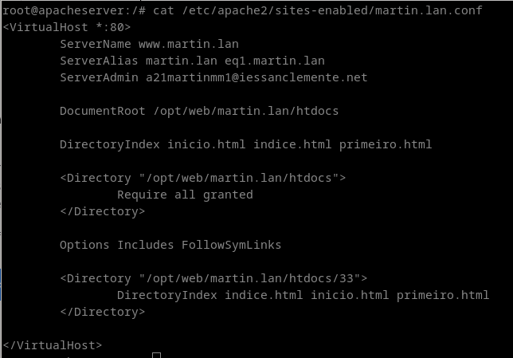
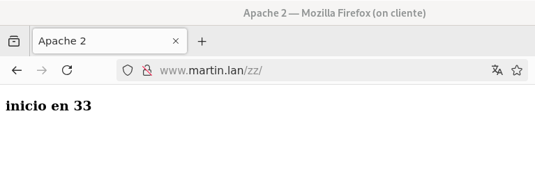
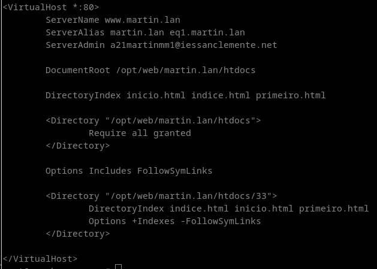
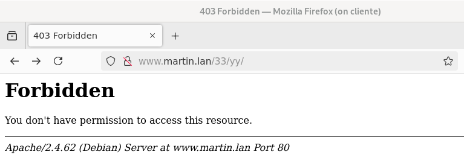
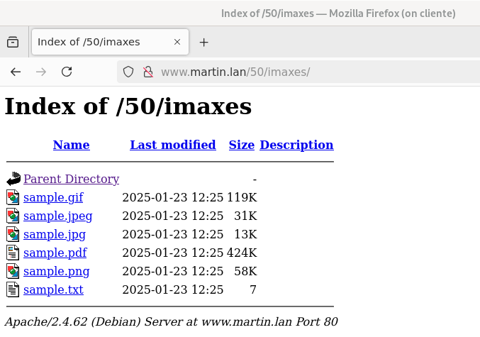
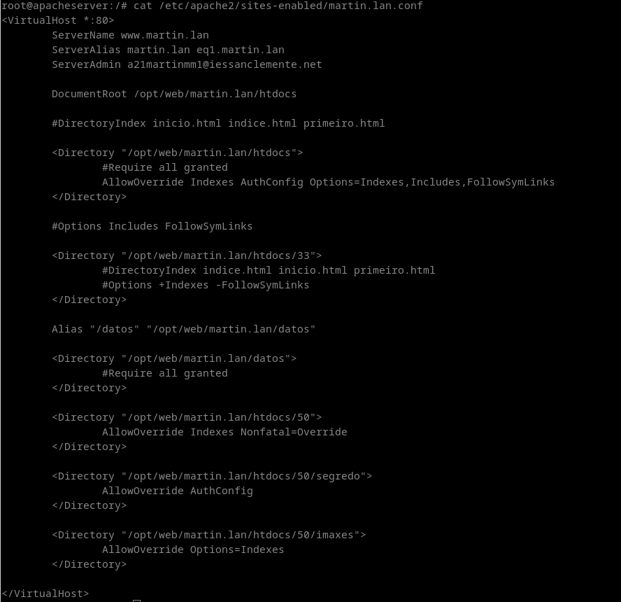
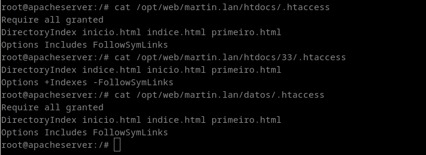

## Necesitaremos ter integrado na nosa rede un servidor DNS. (Unha máquina independente con dnsmasq ou o servidor de FreeNom).

## Necesitamos ter un nome DNS válido que apunte ao enderezo IP da nosa máquina.  Nesta tarefa, supoñemos que o nome do dominio é equipo.lan, pero necesitarás adaptar ao teu nome DNS.

## Configuramos un servidor virtual para www.exemplo.lan (e que tamén responda para exemplo.lan e eq1.exemplo.lan). monta o directorio exemplo.lan en  en /opt/web/exemplo.lan

## Se empregas a máquina virtual de Google Cloud, elixte ti dous dos nomes que teñas ti configurado nun dos teus dominios.

## A configuración para o sitio www.exemplo.lan debe ser a seguinte:

## O raíz de documentos debe ser /opt/web/exemplo.lan/htdocs. A orde de ficheiros de procura debe ser inicio.html, indice.html e primeiro.html por esta orde. Tendo en conta os ficheiros que hai no directorio raíz, indica que ficheiro se amosa accedendo a http://www.exemplo.lan/, http://www.exemplo.lan/11 e http://www.exemplo.lan/22 explicándoo brevemente, e pegando unha captura de pantalla desde o navegador dun cliente.

Na páxina http://www.martin.lan/ amósase o arquivo inicio.html. Na páxina /11 vemos o arquivo indice.html. Na páxina /22 danos un erro de Forbidden porque non hai ningunha páxina cos nomes indicados.

## No host virtual queremos facer que se habiliten as inclusións desde o servidor e se sigan as ligazóns simbólicas. Para probalo, crea unha ligazón simbólica chamado “zz” ao directorio 33 (ámbolos dous dentro do directorio raíz de documentos. Ademais, queremos facer que no directorio 33 a orde de ficheiros de atopar cando se introduce na URL o nome dun directorio, sexa indice.html, inicio.html e primeiro.html. Amosa a configuración establecida e indica razoadamente que ficheiro se debería amosar accedendo a http://www.exemplo.lan/zz e http://www.exemplo.lan/33. Amosa unha captura de pantalla de cada un para demostralo.

Accedendo a /33 deberíase amosar o ficheiro indice.html. E accedendo a /zz deberíase amosar o arquivo inicio.html.

## No directorio 33 (dentro do raíz de documentos) queremos engadir a opción para amosar un listado do contido do directorio no caso de se introduza un directorio na URL e que non exista ningún dos ficheiros especificados anteriormente como de procura e tamén deshabilitar a opción de facer ligazóns simbólicas. Crea unha ligazón simbólica dentro dese directorio chamado yy con destino a 44 (dentro do raíz de documentos). Indica a configuración establecida, engade unha captura de pantalla e explica a saída producida para http://www.exemplo.lan/33/yy http://www.exemplo.lan/33/imaxes , http://www.exemplo.lan/44 e http://www.exemplo.lan/22

Accedendo a /33/yy danos erro de permisos, posto que no directorio /33 non podemos seguir enlaces simbólicos. Accedendo a /33/imaxes vemos un listado cos arquivos dos directorios. Se accedemos a /44 aparecenos o arquivo inicio.html. E, se accedemos a /22, danos erro de permisos, posto que non hai arquivo inicio, indice ou primeiro.html e non está habilitada a opción de listar o directorio.

## Indica como farías, sen alterar o sistema de ficheiros, para que cando accedamos a http://www.exemplo.lan/datos se acceda ao contido que exista dentro de /opt/web/exemplo.lan/datos. Amosa tamén unta captura de pantalla da URL anterior.

Para acceder a /datos sen alterar o sistema de ficheiros, debemos crear un alias da ruta local e darlle permisos para acceder a dita ruta local dentro do host virtual:

## No directorio 50 (dentro da raíz de documentos), tamén queremos habilitar o traballo con ficheiros .htaccess, pero so queremos habilitar as opcións mínimas necesarias para facer o seguinte dentro dese directorio:
- A orde de ficheiros a buscar debe ser un.html, dous.html e tres.html nesa orde, e no subdirectorio abc que está dentro de 50 a orde será tres.html, dous.html e un.html
- No subdirectorio segredo non está permitido o acceso.
- No subdirectorio imaxes queremos habilitar a opción para que cando non existan os ficheiros de procura se amose un listado co contido do directorio.
- No caso de que se poña unha directiva non permitida, trataranse as directivas non permitidas coma non fatais

## Indica os cambios que habería que facer para non ter que poñer de forma explícita unha sección <Directory> para o mesmo directorio indicado pola directiva DocumentRoot, se todos os host virtuais estivesen aloxados dentro de /opt/web

Os cambios que habería que facer son os seguintes: engadir a directiva <Directory> para o directorio /opt/web a nivel de server config (no arquivo /etc/apache2/apache2.conf) coa opción "Require all granted" para permitir a todos os virtual host de dito directorio (similar a como está configurado para /var/www)

## No mesmo suposto que esta tarefa, que pasaría se a directiva DirectoryIndex estivese dentro do directorio indicado coa directiva DocumentRoot?

Os sitios da carpeta htdocs seguirían funcionando igual, sen embargo, os sitios da carpeta datos xa non funcionarían

## Que pasa se poñemos un ficheiro .htaccess no directorio do DocumentRoot?

Non pasaría nada se poñemos un ficheiro .htaccess no directorio do DocumentRoot, posto que a directiva AllowOverride ten o valor None para o directorio /

## Que pasaría se no directorio 50 non existisen os ficheiros un.html, dous.html e tres.html

Se no directorio 50 non existisen os ficheiros un.html, dous.html e tres.html, daría un erro de Forbidden, posto que non existe ningún dos arquivos indicados na directiva DirectoryIndex e non temos a opción Indexes habilitada para listar os elementos do directorio

## Que pasaría se nun ficheiro .htaccess no directorio 50 se introduce unha directiva non permitida, coma por exemplo ErrorDocument?.

Ao ser unha directiva prohibida, o servidor trataríaa como non fatal, posto que así o indicamos coa opción Nonfatal=Override da directiva AllowOverride

## Como farías para configurar os 4 primeiros puntos con ficheiros .htaccess. Amosa a configuración resultante do host virtual, e o contido e localización dos ficheiros .htaccess

Arquivo de configuración do host virtual:

Arquivos .htaccess:
