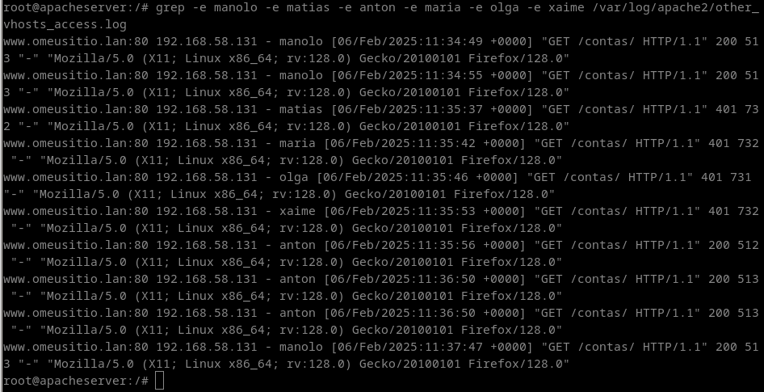

## Configuramos un servidor virtual para www.omeusitio.lan. Descomprime o arquivo omeusitio.lan.tar.gz en  e fai que se monte en /opt/web/oumeusitio.lan

## A configuración do host virtual é a seguinte:

## 1. O directorio raíz de documentos debe ser /opt/web/omeusitio.lan/htdocs, e debe permitir o uso de ficheiros .htaccess relacionados coa autenticación e información de ficheiros. Tamén queremos habilitar a opción para amosar un listado do contido do directorio no caso de se introduza un directorio na URL e que non exista ningún dos ficheiros especificados como de procura nese caso. Indica cal é a configuración do sitio virtual e explícaa detalladamente.

Creamos o virtual host para calquer IP ("*" na etiqueta VirtualHost) e no porto 80 (":80" na etiqueta VirtualHost). Establecemos o nome do host virtual ca etiqueta ServerName, e o alias ca etiqueta ServerAlias. Indicamos tamén o administrador do host con ServerAdmin e a raíz do host ca etiqueta DocumentRoot. Indicamos as opcións do directorio raíz dentro da etiqueta Directory (Options tamén se podería indicar a nivel de host), que son: permitir o acceso con Require, permitir os .htaccess cas opcións demandadas empregando a etiqueta AllowOverride, e permitir mostrar un listado dos directorios con Options Indexes.

## 2. No directorio imaxes, queremos permitir so que se descarguen os ficheiros con extensións .jpg, jpeg, bmp, gif, png e tiff. Todos os demais deberían esta bloqueados.  Explica o resultado obtido unha vez accedido cun navegador web á URL http://www.omeusitio.lan/imaxes tendo en conta o contido do directorio imaxes. Comproba se se pode acceder explicitamente ao ficheiro .pdf que hai dentro dese directorio. 

Ao acceder a http://www.omeusitio.lan/imaxes, danos erro de Forbidden porque prohibimos o acceso por defecto a todo o que non sexan os arquivos coas extensións indicadas. Pero se indicamos na URL o nome dun arquivo en concreto sí que nos permite acceder se a extensión está permitida.

## 3. No directorio datos queremos bloquearlle o acceso aos clientes que teñan enderezo na rede 192.168.58.128/25 mediante ficheiros .htaccess. Indica o contido dese ficheiro, e tamén comproba con un cliente dentro desa subrede e outro fora se se pode acceder ou non a ese directorio.

(neste caso, cambiamos a rede no compose para evitar ter que crear varios clientes e un enrutador)

## 4. No directorio traballadores, queremos habilitar a autenticación Basic, e para elo crearemos os usuarios ana e eva. Gardaremos a lista de usuarios nun ficheiro en /opt/web/omeusitio.lan/ que debería ter un nome que impida ser accedido accidentalmente. Amosa a configuración, a ventá de acceso no navegador e a liña do log onde se ve o nome do usuario que fixo login.

## 5. No directorio directivos, queremos habilitar a autenticación Digest, e para elo crearemos os usuarios xan e lois. Gardaremos a lista de usuarios nun ficheiro en /opt/web/omeusitio.lan/ que debería ter un nome que impida ser accedido accidentalmente. Escolleremos como nome de dominio (realm) “directivos”. Amosa a configuración, a ventá de acceso no navegador e a liña do log onde se ve o nome do usuario que fixo login.

## 6. No directorio contas, usando ficheiros .htaccess, queremos permitir o acceso a certos grupos de usuarios usando autenticación Basic. Gardaremos a lista de usuarios nun ficheiro en /opt/web/omeusitio.lan/ que debería ter un nome que impida ser accedido accidentalmente. Poderán acceder o usuario manolo e os membros do grupo directivos (matias, anton) que sexan a súa vez membros do grupo accionistas (anton, maría, olga) e que non sexan a súa vez membros do grupo temporais (matias, olga, xaime)

## 7. Indica como se faría para impedirlle o acceso á URL http://www.omeusitio.lan/secure aos clientes que teñan un enderezo IP que comece por 172.16 e aos que teñan un nome cuxo dominio sexa apache.lan

Para facer iso, deberíamos engadir a seguinte directiva no arquivo de configuración do host virtual:

    <Directory /opt/web/omeusitio.lan/htdocs/secure>
        <RequireAll>
            Require all granted
            <RequireNone>
                Require ip 172.16
                Require host apache.lan
            </RequireNone>
        </RequireAll>
    </Directory>

## 8. Indica como farías para configurar o acceso ao directorio reservado da seguinte maneira: Para poder acceder, ten que cumprirse que o usuario sexa manolo, ou pertencer ao grupo admin e máis administradores e a súa vez estar no grupo vendas ou comerciais, e que baixo ningún concepto se pertenza ao grupo temporais ou interinos ou que o enderezo IP sexa 192.168.58.99

Para facer iso, deberíamos engadir a seguinte directiva no arquivo de configuración do host virtual:

    <Directory /opt/web/omeusitio.lan/htdocs/reservado>
        AuthType Basic
        AuthName Reservado
        AuthBasicProvider file
        AuthUserFile "/opt/web/omeusitio.lan/.htpasswordsreservado"
        <RequireAny>
            Require user manolo
            <RequireAll>
                Require group admin
                Require group administradores
                <RequireAny>
                    Require group vendas
                    Require group comerciais
                </RequireAny>
                Require not group temporais
                Require not group interinos
                Require not ip 192.168.58.99
            </RequireAll>            
        </RequireAny>
    </Directory>