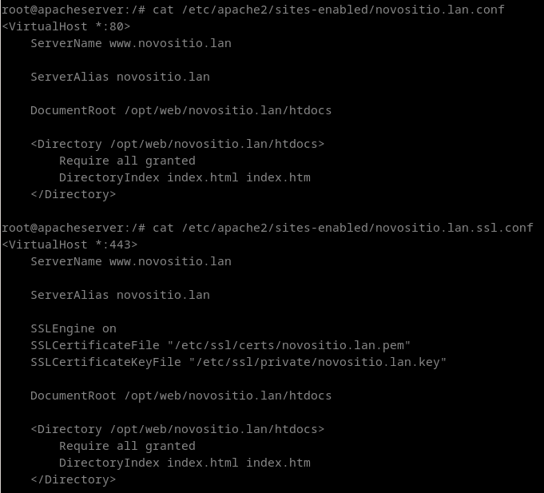
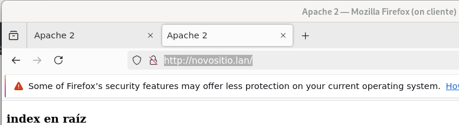
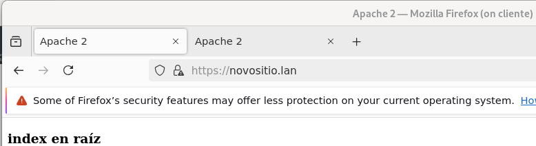

## Tomamos unha máquina Ubuntu/Debian na que temos instalado o servidor DNS. Nese servidor DNSfaremos que os rexistros www.novositio.lan e novositio.lan apunten ao enderezo da máquina virtual empregada. (Non necesario se empregamos a máquina de AWS)

## Na configuración para o sitio www.novositio.lan debe de ter como directorio raíz de documentos /opt/web/novositio.lan/htdocs, e ter como ficheiros por defecto ao introducir a URL dun directorio a index.html e index.htm. Deberás crear os ficheiros .html de exemplo necesarios.

## Crea tamén un certificado autoasinado e habilita outro sitio virtual con https coa mesma configuración que o sitio anterior. 

