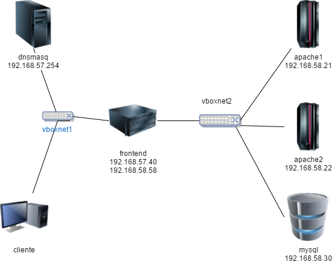
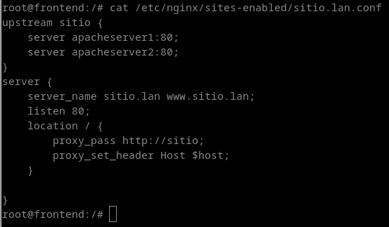
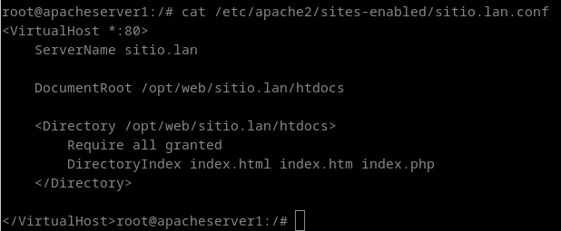
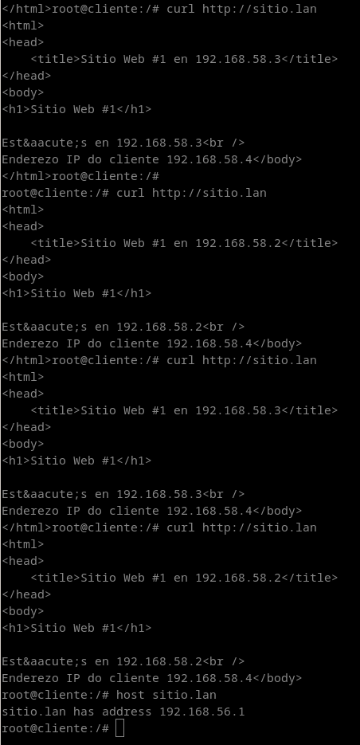
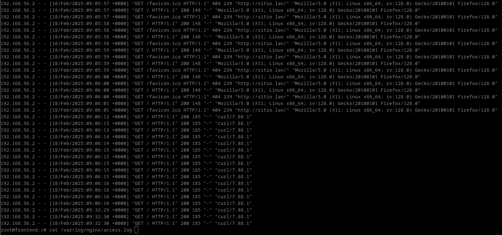
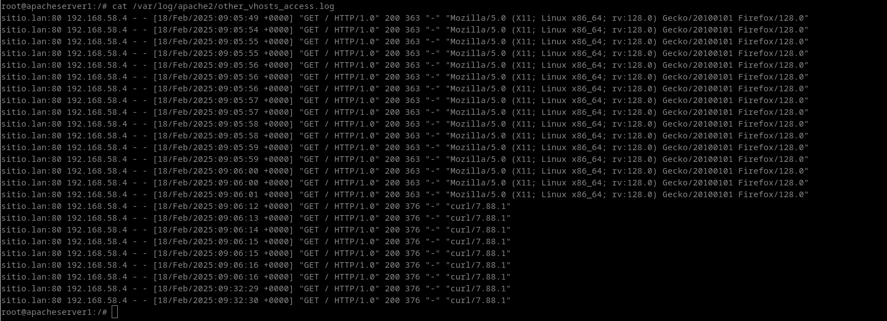
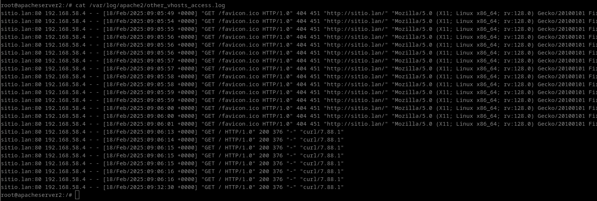

## Tendo en conta o escenario anterior, monta un proxy inverso no equipo fronted con nginx para apache1 e apache2

## Arquivos de configuración de apache1, apache2 e nginx






## Comprobacións desde cliente e vista dos logs do proxy e dos servidores web









## Código do ficheiro index.php (Deberás ter instalados os paquetes libapache2-mod-php php)

```<html>
<head>
    <title><?php echo "Sitio Web #1 en ${_SERVER['SERVER_ADDR']}"?></title>
</head>
<body>
<h1>Sitio Web #1</h1>

<?php echo "Est&aacute;s en ${_SERVER['SERVER_ADDR']}" ?>
<br />
<?php echo "Enderezo IP do cliente ${_SERVER['REMOTE_ADDR']}"?>
</body>
</html>
